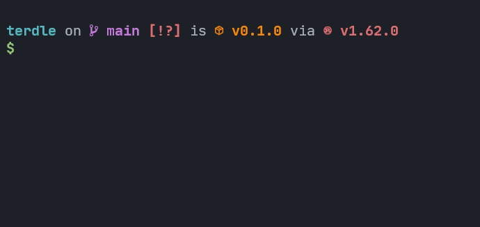

# terdle

> A certain word game but in the terminal.



## Installation and Usage

Grab the latest binary from the
[Github Actions](https://github.com/neelkarma/terdle/actions) tab.

Alternatively, to build from source, install the Rust Toolchain and then

```sh
cargo install --git https://github.com/neelkarma/terdle.git
```

After that, just run `terdle` in the terminal.
